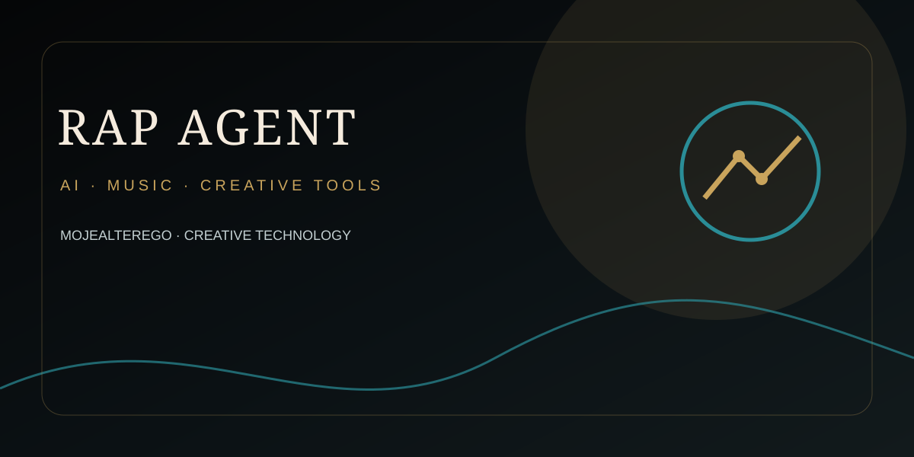

<div align="center">



</div>

---

# RAP-AGENT — Ω∞ SINGULARITY CREATOR

A production-oriented autonomous creator engine for an original fictional Polish rap artist with durable identity, evolving computational affect, associative memory, creator canon, adversarial evaluation and hard quality gates.

## Core invariant

**experience → memory → thought → language → rhythm → voice → music**

Ω∞ is designed as a computational continuity system. It does not claim literal consciousness or sentience.

## Architecture

```text
                         ┌─────────────────────────┐
                         │       USER STIMULUS      │
                         └────────────┬────────────┘
                                      │
                                      v
                         ┌─────────────────────────┐
                         │   PSYCHIC DYNAMICS      │
                         │ affect / arousal /      │
                         │ valence / novelty      │
                         └────────────┬────────────┘
                                      │
                 ┌────────────────────┼────────────────────┐
                 v                    v                    v
       ┌─────────────────┐   ┌─────────────────┐   ┌─────────────────┐
       │ ASSOCIATIVE     │   │ CREATOR CANON   │   │ CREATOR GENOME  │
       │ MEMORY          │   │ timeline /      │   │ identity /      │
       │ weighted graph  │   │ beliefs / works │   │ language / voice│
       └────────┬────────┘   └────────┬────────┘   └────────┬────────┘
                └─────────────────────┼─────────────────────┘
                                      v
                         ┌─────────────────────────┐
                         │    GENERATIVE FORGE     │
                         │ concept → text → flow → │
                         │ voice → production      │
                         └────────────┬────────────┘
                                      v
                         ┌─────────────────────────┐
                         │ LOCAL ADVERSARY         │
                         │ cheap deterministic     │
                         │ pre-filter              │
                         └────────────┬────────────┘
                                      v
                         ┌─────────────────────────┐
                         │ MODEL ADVERSARY         │
                         │ line-level rejection +  │
                         │ global creative audit   │
                         └────────────┬────────────┘
                                      │
                              reject / rebuild
                                      │
                                      v
                         ┌─────────────────────────┐
                         │ DETERMINISTIC QUALITY   │
                         │ POLICY / VETO GATES     │
                         └────────────┬────────────┘
                                      │
                           pass ─────┴───── reject
                            │                 │
                            v                 v
                    ┌──────────────┐   ┌──────────────┐
                    │ CANON +      │   │ REBUILD      │
                    │ FORGE LEDGER │   │ AGAIN        │
                    └──────────────┘   └──────────────┘
```

## Canonical package

`src/omega/` is the authoritative runtime namespace. Root-level compatibility modules are migration artifacts and must not become a second implementation.

### Principal modules

- `psychic.py` — durable affect dynamics and elapsed-time evolution.
- `state_store.py` — transactional SQLite state persistence.
- `memory.py` — canonical associative memory storage and spreading activation.
- `continuity.py` — append-only hashed events and idempotent forge evidence.
- `canon.py` — explicit fictional canon and timeline.
- `identity.py` — configuration-driven creator identity.
- `adversary.py` — deterministic local anti-generic pre-filter.
- `engine.py` — artifact hashing and hard acceptance policy.
- `quality.py` — deterministic quality decision layer.
- `orchestrator.py` — end-to-end forge orchestration.
- `runtime.py` — single composition root for the running organism.

## Persistence model

SQLite is the runtime source of truth. GitHub is a versioned persistence and deployment boundary.

The system persists:

- psychic state;
- affect dimensions;
- timestamps and state versions;
- continuity events;
- associative memories and synaptic strengths;
- forge evidence;
- creator canon.

Uncertain or generated recollections are never automatically promoted into immutable canon.

## Quality doctrine

Identity and originality are veto dimensions. A high aggregate score cannot override a critical identity or originality failure. The project explicitly rejects direct imitation, recognizable mannerism copying, generic declaration floods, forced slang, unmotivated profanity and broken fictional canon.

The quality gates are defined in `config/quality-gates.json` and the active production policy in `config/system.json`.

## Runtime

```bash
python -m pip install -e .
export OPENAI_API_KEY='...'
uvicorn api:app --host 0.0.0.0 --port 8000
```

Endpoints:

- `GET /health`
- `GET /state`
- `GET /canon`
- `GET /events`
- `POST /wake`
- `POST /forge`

### Forge request

```json
{
  "prompt": "...",
  "max_cycles": 12
}
```

Use the `Idempotency-Key` HTTP header for repeat-safe forge requests.

## Verification

```bash
python scripts/audit.py
python -m pytest -q
```

GitHub Actions runs integrity checks and tests on every push and pull request, and a serialized scheduled workflow performs bounded persistence wake-ups.
